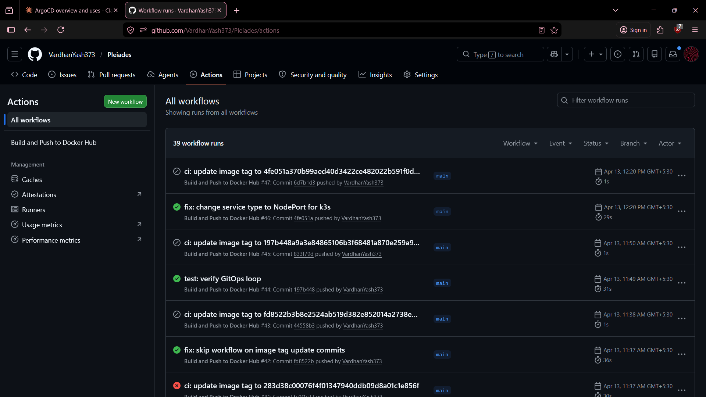
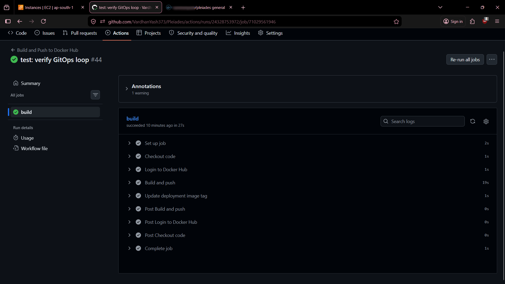
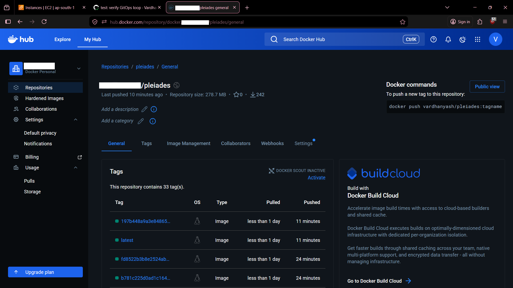
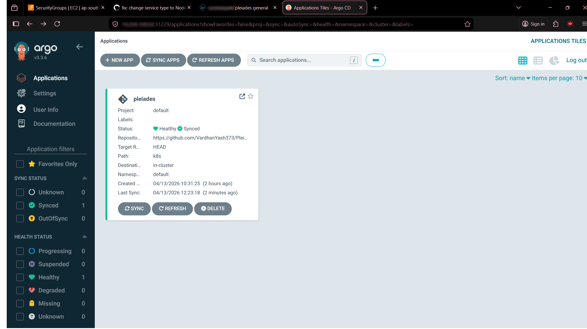
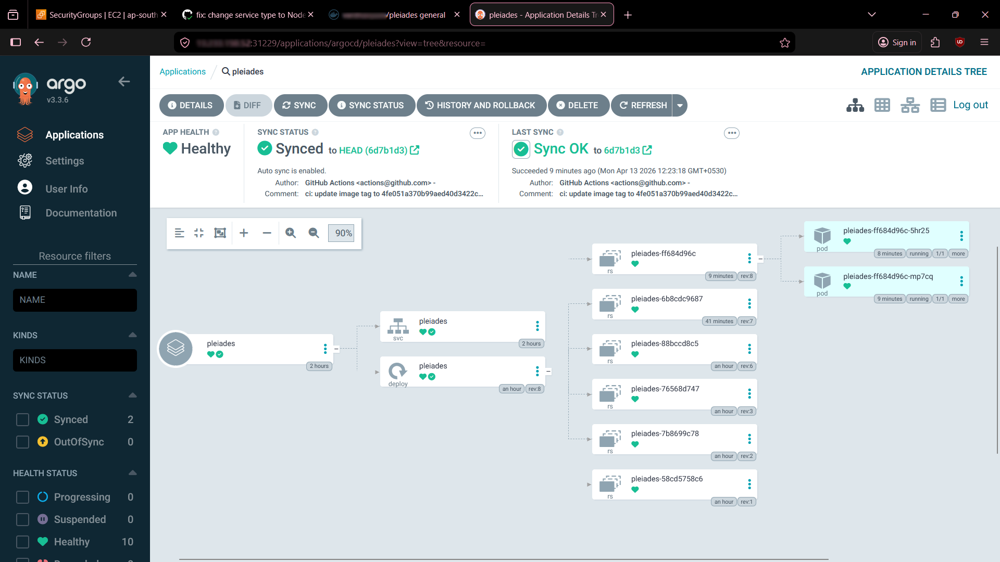
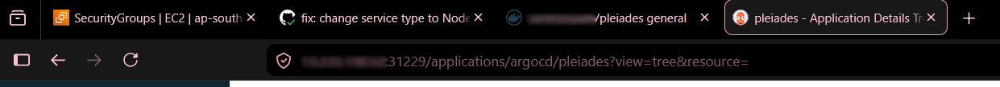
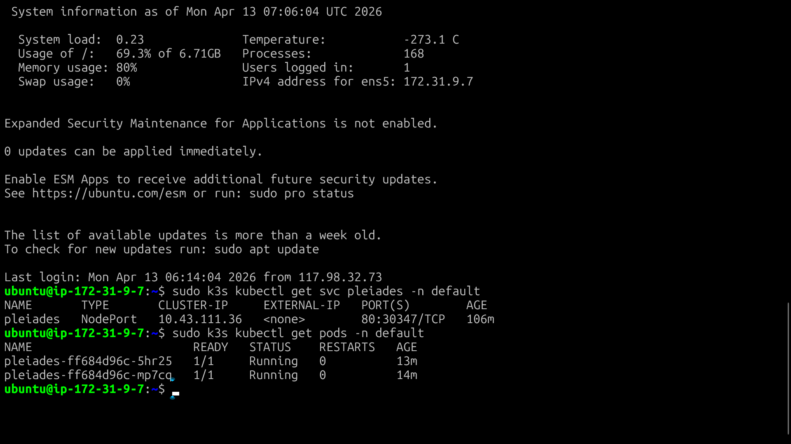
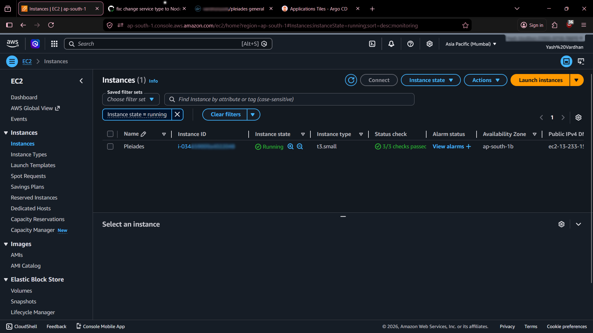
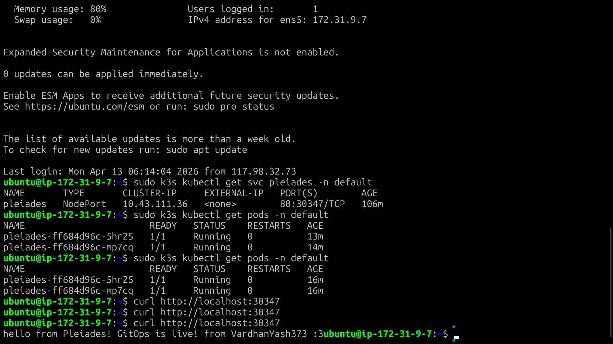
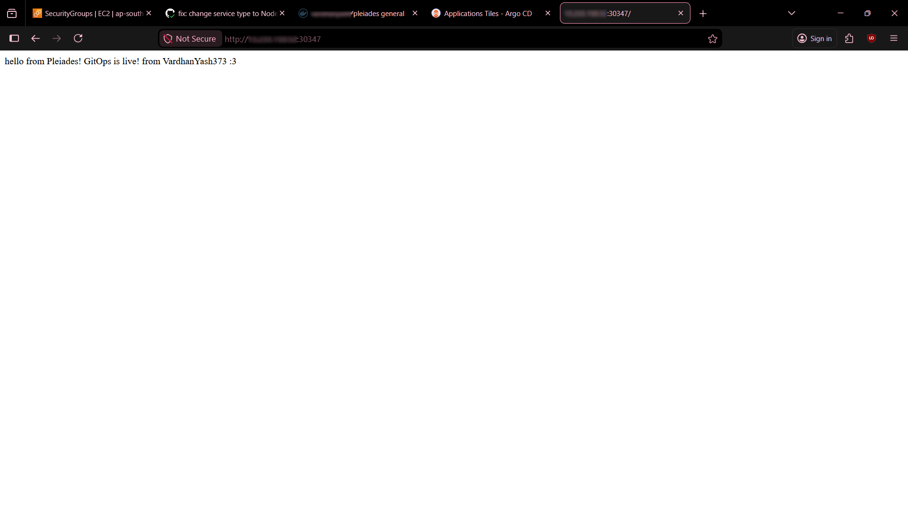

# Pleiades 🌌

A fully automated GitOps pipeline that deploys a containerized Flask application to a Kubernetes cluster on AWS — triggered entirely by a Git push.

Every commit to this repository automatically builds a new Docker image, pushes it to Docker Hub, updates the Kubernetes manifest with the new image tag, and syncs the live cluster via ArgoCD — with zero manual intervention.

---

## Pipeline Overview

```
Git Push
   │
   ▼
GitHub Actions
   ├── Build Docker image
   ├── Push to Docker Hub (tagged with commit SHA)
   └── Update image tag in deployment.yml
          │
          ▼
       ArgoCD (watching repo)
          └── Detects manifest change
                 └── Auto-syncs to k3s on AWS EC2
                        └── Flask app live ✅
```

---

## Stack

| Layer | Technology |
|---|---|
| Application | Python / Flask |
| Containerization | Docker, Docker Hub |
| CI/CD | GitHub Actions |
| Infrastructure | AWS EC2 (t3.small, ap-south-1) |
| IaC | Terraform |
| Kubernetes | k3s |
| GitOps | ArgoCD |
| OS / Runtime | Ubuntu, WSL2 |

---

## How It Works

### 1. CI — GitHub Actions

On every push to `main`, a GitHub Actions workflow:
- Builds a Docker image from the Flask app
- Tags it with the commit SHA for precise version tracking
- Pushes it to Docker Hub
- Writes the new image tag back into `k8s/deployment.yml` via a commit

This ensures the repository always reflects exactly what is running in the cluster.

### 2. CD — ArgoCD GitOps

ArgoCD continuously watches this repository. When it detects the updated image tag in `deployment.yml`, it automatically syncs the change to the k3s cluster running on AWS EC2 — no `kubectl apply` required.

### 3. Infrastructure — Terraform + k3s

The EC2 instance is provisioned using Terraform. k3s (lightweight Kubernetes) is installed on the instance. ArgoCD runs inside the cluster and is exposed via NodePort for external access.

A swap file is configured on the instance to ensure stable operation of k3s and ArgoCD within the memory constraints of a t3.small (2GB RAM).

---

## Repository Structure

```
Pleiades/
├── app/
│   ├── app.py               # Flask application
│   ├── requirements.txt
│   └── Dockerfile
├── k8s/
│   ├── deployment.yml       # Kubernetes Deployment (auto-updated by CI)
│   └── service.yml          # Kubernetes Service (NodePort)
├── terraform/
│   ├── main.tf              # EC2 provisioning
│   ├── variables.tf
│   └── outputs.tf
└── .github/
    └── workflows/
        └── build-push.yml   # GitHub Actions CI/CD workflow
```

---

## Screenshots

### GitHub Actions — Workflow Run


### GitHub Actions — Image Tag Update Step


### Docker Hub — SHA-tagged Images


### ArgoCD — Healthy and Synced


### ArgoCD — Resource Tree


### ArgoCD — IP and Port Exposure


### Kubernetes — Pods Running


### AWS EC2 — Instance Console


### Flask App — Terminal Response


### Flask App — Browser Response


## Key Engineering Decisions

**Why k3s over full Kubernetes?**
k3s is a production-grade lightweight Kubernetes distribution well suited for single-node deployments. It runs comfortably on a t3.small with swap configured, unlike standard kubeadm setups which require more resources.

**Why commit SHA tags instead of `latest`?**
Tagging images with the commit SHA creates a precise, auditable link between every running container and the exact code that built it. It also prevents ArgoCD from missing updates, since `latest` is a mutable tag that ArgoCD cannot diff against.

**Why ArgoCD over plain `kubectl apply` in CI?**
ArgoCD makes Git the single source of truth for cluster state. It continuously reconciles the cluster against the repo, meaning manual changes to the cluster are detected and corrected automatically. This is the core GitOps pattern.

---

## Lessons Learned

- Always add `.gitignore` before running `terraform init` — the AWS provider binary is 600MB+ and will fill your git history if committed accidentally
- t3.micro (1GB RAM) is insufficient for running k3s and ArgoCD simultaneously — t3.small with a swap file is the minimum viable setup
- ArgoCD on WSL2 requires NodePort exposure to be accessible from a Windows browser — localhost port-forwarding alone does not work
- GitHub Actions needs explicit `write` permissions on `contents` to push manifest updates back to the repository

---

## Running This Yourself

### Prerequisites

- AWS account with an IAM user and credentials configured
- Terraform installed
- Docker installed
- `kubectl` installed
- A Docker Hub account

### 1. Provision Infrastructure

```bash
cd terraform
terraform init
terraform apply
```

### 2. Install k3s on EC2

```bash
ssh -i ~/.ssh/your-key ubuntu@<ec2-ip>
curl -sfL https://get.k3s.io | sh -
```

### 3. Install ArgoCD

```bash
kubectl create namespace argocd
kubectl apply -n argocd -f https://raw.githubusercontent.com/argoproj/argo-cd/stable/manifests/install.yaml
```

### 4. Add GitHub Secrets

In your repository settings, add:
- `DOCKER_USERNAME`
- `DOCKER_PASSWORD`
- `GH_PAT` — a Personal Access Token with repo write permissions

### 5. Push to main

```bash
git push origin main
```
The pipeline runs automatically from here.

### Cleanup

```bash
terraform destroy
```

---

## Author

Built as a portfolio project to demonstrate end-to-end GitOps with Kubernetes, IaC, and CI/CD on AWS.
